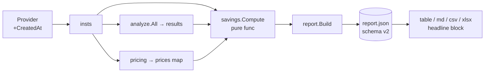

# Design: Savings Score

**Date:** 2026-07-24
**Status:** proposed
**Stack:** Go 1.25 CLI (single binary). No gRPC/HTTP/frontend — see *Deviations*.

## Problem

The telescope report is flat: per-instance utilization + optional list cost, but no
top-line waste number. The PRD (`docs/product/savings-score.md`, issues #5–#9) calls
for a **Savings Score** — total spend, under-utilized spend %, always-on instance %,
and estimated recoverable dollars — computed from data the pipeline already has, plus
one new inventory signal (instance uptime). It must be honest (conservative,
auditable) and demonstrable offline via the mock provider.

## Design

The pipeline stays `Provider → analyze → pricing → report`. The Score is a **new pure
computation stage** that consumes the three existing outputs plus a new `CreatedAt`
inventory field, and emits one struct embedded in the report contract.



### Components (all Go packages in the existing module)

1. **`internal/savings`** *(new)* — the core. One pure function plus typed config;
   no I/O, no globals. This is the seam that makes the formula unit-testable in
   isolation.
   ```go
   type Config struct {
       UnderutilizedThreshold float64 // top normalized p95 below this ⇒ under-utilized (0.30)
       AlwaysOnHours          float64 // running longer than this ⇒ always-on (720)
       RightsizingFraction    float64 // recoverable share of non-idle under-utilized spend (0.5)
   }
   func Defaults() Config // {0.30, 720, 0.5}

   // Compute is pure: same inputs ⇒ same Score. prices may be nil (pricing off).
   func Compute(insts []model.Instance, results []analyze.Result,
       prices map[string]*pricing.PriceInfo, now time.Time, cfg Config) Score
   ```
   `now` is injected (not `time.Now()`) so always-on tests are deterministic.

2. **`internal/model`** *(extend)* — add the uptime signal as a strict field:
   ```go
   // CreatedAt is when the instance was created/launched (zero = unknown).
   CreatedAt time.Time
   ```
   Plus a predicate kept beside the data it reads:
   ```go
   // RunningHours is elapsed time since creation (0 if CreatedAt unknown).
   func (i Instance) RunningHours(now time.Time) float64
   ```

3. **`internal/provider/gcp` + `internal/provider/aws`** *(extend)* — populate
   `CreatedAt`. GCP: parse `Instance.GetCreationTimestamp()` (RFC3339) → zero on parse
   error (never fail the scan). AWS: `Instance.LaunchTime` (already `*time.Time`).
   `mock` sets a spread of ages so always-on % is a plausible non-zero offline.

4. **`internal/report`** *(extend)* — `report.Build` calls `savings.Compute` and
   attaches `SavingsScore`; `SchemaVersion` bumps `"1" → "2"`.

5. **`internal/report` renderers** *(extend)* — a shared `savingsHeadline(*Score)
   string` printed as a header block by table/markdown, a summary row in CSV, and a
   summary sheet in XLSX.

6. **`internal/cli/scan.go`** — no structural change; `report.Build` already receives
   `insts, results, prices`, so the Score is computed inside Build. Keeps scan.go thin.

## Contracts

The one versioned contract is **`report.json`** (Go structs with json tags;
`report.SchemaVersion` is the version). New shapes, all in `internal/savings`:

```go
type Score struct {
    TotalMonthlyUSD          *float64 `json:"total_monthly_usd,omitempty"`          // nil w/o pricing
    UnderutilizedSpendPct    *float64 `json:"underutilized_spend_pct,omitempty"`    // spend-weighted; nil w/o pricing
    UnderutilizedInstancePct float64  `json:"underutilized_instance_pct"`           // count-weighted; always present
    AlwaysOnInstancePct      float64  `json:"always_on_instance_pct"`               // always present
    RecoverableMonthlyUSD    *float64 `json:"recoverable_monthly_usd,omitempty"`    // nil w/o pricing
    Basis                    Basis    `json:"basis"`
}

type Basis struct {
    UnderutilizedThreshold float64 `json:"underutilized_utilization_threshold"` // 0.30
    IdleFloor              float64 `json:"idle_floor"`                          // 0.15 (from analyze.Defaults)
    AlwaysOnHours          float64 `json:"always_on_hours"`                     // 720
    RightsizingFraction    float64 `json:"rightsizing_fraction"`               // 0.5
    RecoverableFormula     string  `json:"recoverable_formula"`                // human-readable
    InstanceCount          int     `json:"instance_count"`
    PricedInstances        int     `json:"priced_instances"`
    IdleInstances          int     `json:"idle_instances"`
    UnderutilizedInstances int     `json:"underutilized_instances"`
    ExcludedNoData         int     `json:"excluded_no_data"`      // insufficient-data, excluded from util %
    AlwaysOnUnknown        int     `json:"always_on_unknown"`     // no CreatedAt and no sample-density signal
}
```

Embedded in the report:
```go
type Report struct {
    // ...existing...
    SavingsScore *savings.Score `json:"savings_score,omitempty"`
}
```

### Computation rules (the auditable core)

- **`top(inst)`** = max present value in `results.Norm` (the analyze normalized p95 per
  dimension). Instances classified `insufficient-data` (no present dims) are excluded
  from util denominators and counted in `ExcludedNoData`.
- **under-utilized** ⇔ `top(inst) < UnderutilizedThreshold` (0.30). Distinct from
  analyze's `idle` (all dims < 0.15 `IdleFloor`); every idle instance is also
  under-utilized, not vice-versa.
- **`UnderutilizedInstancePct`** = under-utilized ÷ (instances with data). Always
  computable.
- **`UnderutilizedSpendPct`** = Σ monthly spend of under-utilized priced instances ÷
  Σ monthly spend of all priced instances. Needs pricing → nil otherwise.
- **always-on** predicate (one bool, two signals, in priority order):
  1. `CreatedAt` known → `RunningHours(now) ≥ AlwaysOnHours`.
  2. else fall back to **sample density**: `Metrics.Present && Samples ≥ 0.95 ×
     expected samples for the window` (continuous coverage ⇒ ran the whole window).
  3. else neither available → not counted as always-on, increment `AlwaysOnUnknown`.
  `AlwaysOnInstancePct` = always-on ÷ instance count.
- **`RecoverableMonthlyUSD`** = Σ monthly spend of `idle` instances (100%) +
  `RightsizingFraction` × Σ monthly spend of under-utilized-but-not-idle instances.
  Spot and unpriced instances contribute $0. Invariant asserted in code:
  `Recoverable ≤ TotalMonthly`. `RecoverableFormula` string echoes this for the reader.
- **Empty/edge**: zero instances or zero priced spend ⇒ pcts are `0`, no divide-by-zero;
  dollar fields nil when no pricing.

## Test strategy

**`internal/savings` (unit, table-driven — the priority suite).** Pure function, zero
mocks. Cases pin every rule above:
- all-idle priced fleet ⇒ `Recoverable == Total`, `UnderutilizedSpendPct == 100`.
- pricing nil ⇒ dollar fields nil, both instance-count pcts present.
- Spot idle instance ⇒ contributes $0 to Recoverable though counted idle.
- one `insufficient-data` instance ⇒ excluded from util %, `ExcludedNoData == 1`.
- always-on age boundary: `CreatedAt` at 719h vs 721h (with fixed `now`) flips the bit.
- always-on fallback: `CreatedAt` zero + full sample density ⇒ always-on; sparse
  samples ⇒ not, `AlwaysOnUnknown` accounting correct.
- mixed idle+under-utilized ⇒ Recoverable = idle spend + 0.5 × under-utilized spend;
  assert `Recoverable ≤ Total`.
- empty fleet ⇒ all zeros, no panic.

**`internal/model` (unit).** `RunningHours` table: known/zero `CreatedAt`, `now` before
`CreatedAt` (clamp to 0).

**Providers (unit, extend existing fixtures).** GCP: `CreationTimestamp` RFC3339 →
`CreatedAt`; malformed string ⇒ zero, no error. AWS: `LaunchTime` → `CreatedAt`. Both
follow the existing fake-SDK-response patterns; no network.

**`internal/report` (unit).** `Build` attaches `SavingsScore`; `SchemaVersion == "2"`;
Score absent when… it's always present (score computes even with no pricing) — assert
dollar fields nil without prices.

**Renderers (unit, substring/golden).** Headline line present and formatted
(`Savings Score: ~$X/mo recoverable (Y% of spend under-utilized, N of M always-on)`);
`--pricing` off variant shows count-pcts + the "run with --pricing" hint.

**e2e slice (happy path, pairs with `/qa:e2e-test`).**
`telescope scan --provider mock --pricing --output json` ⇒ `savings_score` present with
non-zero `always_on_instance_pct` and `recoverable_monthly_usd`; `--output table` shows
the headline. Offline, deterministic via the mock provider.

What runs real vs mocked: everything is pure or fixture-driven; no external services,
so no containers needed for this feature's tests (consistent with the existing suite).

## Deviations from the default stack

- **No protobuf/gRPC/grpc-gateway, no Next.js/React frontend.** This feature — like the
  entire telescope repo — is a single Go data-collector CLI with no network service or
  UI. The typed boundary the default stack asks for is satisfied by the **versioned
  `report.json` schema** (Go structs with json tags, gated by `report.SchemaVersion`),
  which is the actual contract consumed downstream by the Footprint AI cloud service.
  *Containment:* the schema is the only external surface; its version bump (`1→2`)
  signals the additive `savings_score` field to consumers. Adding a proto layer for an
  offline CLI report would be pure overhead. This matches the codebase's existing,
  deliberate shape — not a new deviation.
- **Thresholds are typed constants (`savings.Defaults()`) surfaced in `basis`, not CLI
  flags.** Keeps MVP surface small while staying auditable. Promote to flags later only
  if sales needs per-report tuning (noted in PRD open questions).

## Rejected alternatives

- **Fold the Score math into `report.Build` inline (no `savings` package).** Rejected:
  couples report assembly to business logic and makes the formula hard to unit-test in
  isolation. A pure `savings.Compute` is the testable seam; `Build` stays an assembler.
- **Always-on from metric sample density as the *primary* signal.** Rejected as primary
  (kept as fallback): it only observes the lookback window (default 14d), so it can't
  distinguish a 3-week-old always-on VM from a 2-year-old one, and it conflates
  "monitored" with "running." `CreatedAt` age is the direct, cheap primary; density
  covers the `CreatedAt`-unknown tail.
- **Expose 30% / 0.5 as CLI flags now.** Rejected for MVP: more surface, more docs, and
  the numbers are unvalidated assumptions (PRD). Constants-in-`basis` keep them
  auditable and changeable in one place until sales confirms them.

## What changes at 10× (not built now)

Nothing in this design breaks at 10× instances — `Compute` is O(n) over a slice already
held in memory. The only pressure point is the metrics/inventory fetch that already
exists upstream; the Score adds no new external calls.
